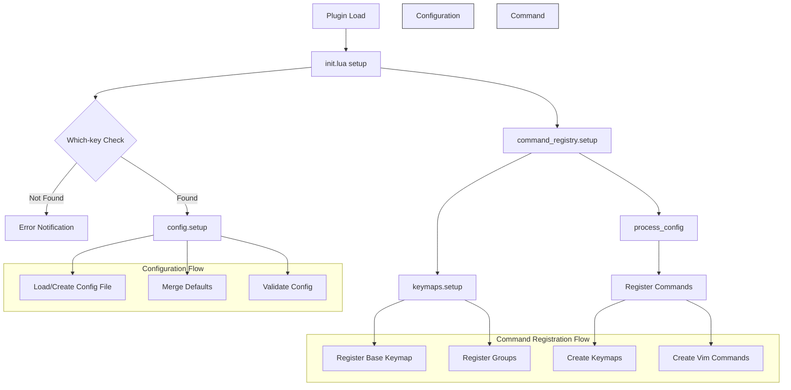

# Neoterm

A Neovim plugin, with a persistent floating terminal window with (Python in Linux) 
virtual environment activation.

**Version = 0000.00.00.0**

## Caution - A Friendly Warning 🏗️

It started out as a [TJ DeVries floating toggle-able terminal](https://youtu.be/5PIiKDES_wc?si=y-k1ujkzFtNobuRp)
And here we are 🎉

Neoterm is still taking its first steps into the world! While it's especially 
helpful for Django developers (making their lives just a bit easier), it's 
very much a work in progress. Think of it as a cozy little house where the 
paint's still wet and we're still looking for some furniture.

Django Users: Simply open nvim in your project root, and most things should work 
like magic (fingers crossed! 🤞)
Django & Python Developers: You might find our virtual env keymaps particularly handy!

We're growing and learning every day, so while we may not have all the bells and whistles 
of tmux for bigger projects, we're perfect for those smaller coding adventures! 🚀


## Requirements

- Neovim >= 0.10.0
- [which-key.nvim](https://github.com/folke/which-key.nvim) (required dependency)

## Installation

### Using [lazy.nvim](https://github.com/folke/lazy.nvim) (recommended):
```lua
{
  "imAsparky/neoterm",
  opts = {
    venv_name = "venv", -- default virtual environment name
  },
}
```

### Using [packer.nvim](https://github.com/wbthomason/packer.nvim):
```lua
use {
  'imAsparky/neoterm',
  requires = {'folke/which-key.nvim'},
  config = function()
    require('neoterm').setup({
      venv_name = "venv", -- default virtual environment name
    })
  end
}
```

### Using [vim-plug](https://github.com/junegunn/vim-plug):
```vim
" First install which-key
Plug 'folke/which-key.nvim'

" Then install neoterm
Plug 'imAsparky/neoterm'

" After installing, in your init.vim/init.lua:
lua require('neoterm').setup({
  venv_name = "venv", -- default virtual environment name
})
```

## Health Check - Your Friendly Setup Assistant 🔍

Want to make sure everything's purring along nicely? Run `:checkhealth neoterm`
to get a comprehensive checkup! Our health wizard will check:

- If your Neovim is fresh enough (needs 0.10.0 or newer)
- Your leader key setup (because leaders are important!)
- Any keymap conflicts (we don't want any key-fighting)
- Terminal support (making sure we can talk to the outside world)
- which-key.nvim presence (required for that extra bit of magic)

### About Those Keymaps ⌨️

By default, we use `<leader>n` as our magical prefix for all commands. 
But what if you're already using that combination? No worries! 
The health check will let you know if there are any conflicts, and you 
can easily pick a different letter:

```lua
{
  "imAsparky/neoterm",
  opts = {
    venv_name = "venv", -- default virtual environment name
    key_prefix = 't'  -- Change 'n' to any other unused letter
  },
}
```

## Features

- Floating terminal window
- Virtual environment activation
- Persistent configuration
- Integration with which-key for enhanced key bindings

## Usage

### Commands

- `:Neoterm` - Toggle floating terminal
- `:NeotermSetVenv <name>` - Set virtual environment name

### Default Keymaps

- `<leader>nt` - Toggle terminal
- `<leader>nvw` - Activate workspace venv
- `<leader>nvp` - Activate parent directory venv
- `<leader>nvc` - Configure venv name

## Configuration

```lua
require("neoterm").setup({
  venv_name = "venv", -- default virtual environment name
  key_prefix = 't'  -- Change 'n' to any other unused letter
})
```

## License

Apache 2.0

## Neoterm Flow Chart


