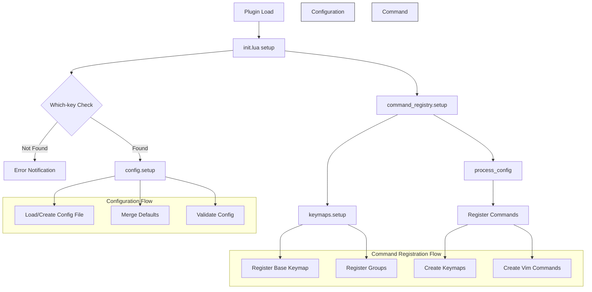

# Neoterm

A Neovim plugin, with a persistent floating terminal window with (Python in Linux) 
virtual environment activation.

**Version = 2025.07.05.1**

## Caution - A Friendly Warning 🏗️

It started out as a [TJ DeVries floating toggle-able terminal](https://youtu.be/5PIiKDES_wc?si=y-k1ujkzFtNobuRp)

And here we are 🎉

Neoterm is still taking its first steps into the world! While it's especially 
helpful for Django developers (making their lives just a bit easier), it's 
very much a work in progress. Think of it as a cozy little house where the 
paint's still wet and we're still looking for some furniture.

Django Users: Simply open nvim in your project root, and most things should work 
like magic (fingers crossed! 🤞)
Django & Python Developers: You might find our virtual env keymaps particularly handy!

We're growing and learning every day, so while we may not have all the bells and whistles 
of tmux for bigger projects, we're perfect for those smaller coding adventures! 🚀


## Requirements

- Neovim >= 0.10.0
- [which-key.nvim](https://github.com/folke/which-key.nvim) (required dependency)

## Installation

### Using [lazy.nvim](https://github.com/folke/lazy.nvim) (recommended):
```lua
{
  "imAsparky/neoterm",
  opts = {
    key_prefix = "n", -- default menu key prefix
  },
}
```

### Using [packer.nvim](https://github.com/wbthomason/packer.nvim):
```lua
use {
  'imAsparky/neoterm',
  requires = {'folke/which-key.nvim'},
  config = function()
    require('neoterm').setup({
      key_prefix = "n", -- default menu key prefix
    })
  end
}
```

### Using [vim-plug](https://github.com/junegunn/vim-plug):
```vim
" First install which-key
Plug 'folke/which-key.nvim'

" Then install neoterm
Plug 'imAsparky/neoterm'

" After installing, in your init.vim/init.lua:
lua require('neoterm').setup({
  key_prefix = "n", -- default menu key prefix
})
```

## Health Check - Your Friendly Setup Assistant 🔍

Want to make sure everything's purring along nicely? Run `:checkhealth neoterm`
to get a comprehensive checkup! Our health wizard will check:

- If your Neovim is fresh enough (needs 0.10.0 or newer)
- Your leader key setup (because leaders are important!)
- Any keymap conflicts (we don't want any key-fighting)
- Terminal support (making sure we can talk to the outside world)
- which-key.nvim presence (required for that extra bit of magic)

### About Those Keymaps ⌨️

By default, we use `<leader>n` as our prefix for all commands. 
But what if you're already using that combination? No worries! 
The health check will let you know if there are any conflicts, and you 
can easily pick a different letter:

```lua
{
  "imAsparky/neoterm",
  opts = {
    key_prefix = 't'  -- Change 'n' to any other unused letter
  },
}
```

## Features

- Floating terminal window
- Virtual environment activation
- Persistent configuration
- Integration with which-key for enhanced key bindings
- This version is for Django development, more to come.

## Usage

### Commands

- `:Neoterm` - Toggle
    Alternative command to toggle the terminal window.

### Virtual Environment Commands:

- `:NeotermVenvActivate`
    Activate the current virtual environment. The environment directory is
    determined by the configured path setting, and if not set will walk up the 
    directory until it finds one of the typical venv directory names and use that.

- `:NeotermVenvSelect` **Not yet implemented!**
    Select and activate a virtual environment. Opens a picker to choose from
    available virtual environments in the current project.

- `:NeotermVenvShow`
    Show the current virtual environment path. Displays the full path to the
    active virtual environment, if one is activated.

- `:NeotermSetVenv` {path}
    Set the virtual environment directory {path}. This changes the
    default path used for setting virtual environments.

### Bash Configuration Commands: **Requires you to have bash aliases set!**

- `:NeotermEBAL`
    Edit bash aliases file. Opens the user's bash aliases configuration file
    in a new buffer.

- `:NeotermEBRC`
    Edit bashrc file. Opens the user's .bashrc configuration file in a new
    buffer.

### Django Management Commands: **Requires you to be working in a Django project!**

- `:NeotermRunServer`
    Run Django development server using ./manage.py runserver.

- `:NeotermTailwind` **Requires django-tailwind!**
    Start Django Tailwind CSS framework using ./manage.py tailwind start.

- `:NeotermShellPlus` **Requires django-extensions!**
    Launch Django Shell Plus with ./manage.py shell_plus. Provides an enhanced
    interactive Python shell with all Django models auto-imported.

- `:NeotermDiffSettings`
    Show differences between current Django settings and default settings using
    ./manage.py diffsettings.

- `:NeotermCollectStatic`
    Collect all static files into a single location for deployment using
    ./manage.py collectstatic.

Note: All Django management commands require a Django project with manage.py in
the current working directory.

### Default Keymaps

- `<leader>nt`    Toggle terminal window
- `<leader>nva`   Activate workspace virtual environment
- `<leader>nvs`   Set virtual environment path
- `<leader>nvw`   Display current working virtual environment path 
- `<leader>naa`   Edit bash aliases
- `<leader>nar`   Edit bashrc file
- `<leader>ndc`   django collectstatic
- `<leader>ndd`   django diffsettings
- `<leader>ndr`   django runserver
- `<leader>nds`   django extensions shellplus
- `<leader>ndt`   django tailwind start


## Configuration

```lua
require("neoterm").setup({
  key_prefix = 't'  -- Change 'n' to any other unused letter to prevent conflicts
})
```

## License

Apache 2.0

## Neoterm Flow Chart

