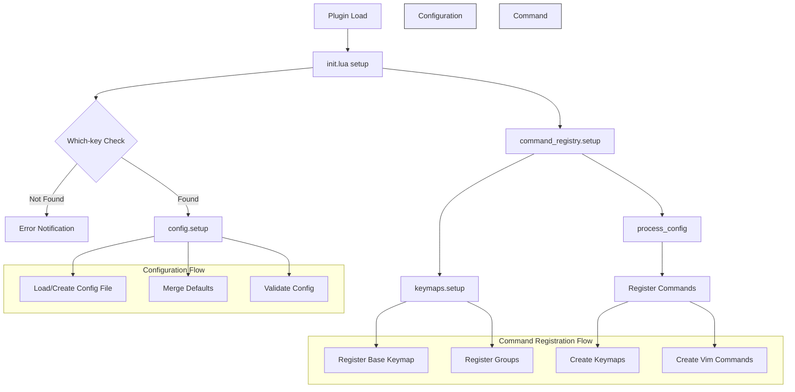

# Neoterm

A Neovim plugin for managing terminal windows with virtual environment support.

## Requirements

- Neovim >= 0.8.0
- [which-key.nvim](https://github.com/folke/which-key.nvim) (required dependency)

## Installation

### Using [lazy.nvim](https://github.com/folke/lazy.nvim) (recommended):
```lua
{
  "imAsparky/neoterm",
  opts = {
    venv_name = "venv", -- default virtual environment name
  },
}
```

### Using [packer.nvim](https://github.com/wbthomason/packer.nvim):
```lua
use {
  'imAsparky/neoterm',
  requires = {'folke/which-key.nvim'},
  config = function()
    require('neoterm').setup({
      venv_name = "venv", -- default virtual environment name
    })
  end
}
```

### Using [vim-plug](https://github.com/junegunn/vim-plug):
```vim
" First install which-key
Plug 'folke/which-key.nvim'

" Then install neoterm
Plug 'imAsparky/neoterm'

" After installing, in your init.vim/init.lua:
lua require('neoterm').setup({
  venv_name = "venv", -- default virtual environment name
})
```

## Features

- Floating terminal window
- Virtual environment activation
- Persistent configuration
- Integration with which-key for enhanced key bindings

## Usage

### Commands

- `:Neoterm` - Toggle floating terminal
- `:NeotermSetVenv <name>` - Set virtual environment name

### Default Keymaps

- `<leader>nt` - Toggle terminal
- `<leader>nvw` - Activate workspace venv
- `<leader>nvp` - Activate parent directory venv
- `<leader>ncn` - Configure venv name

## Configuration

```lua
require("neoterm").setup({
  venv_name = "venv", -- default virtual environment name
})
```

## License

Apache 2.0

## Neoterm Flow Chart


